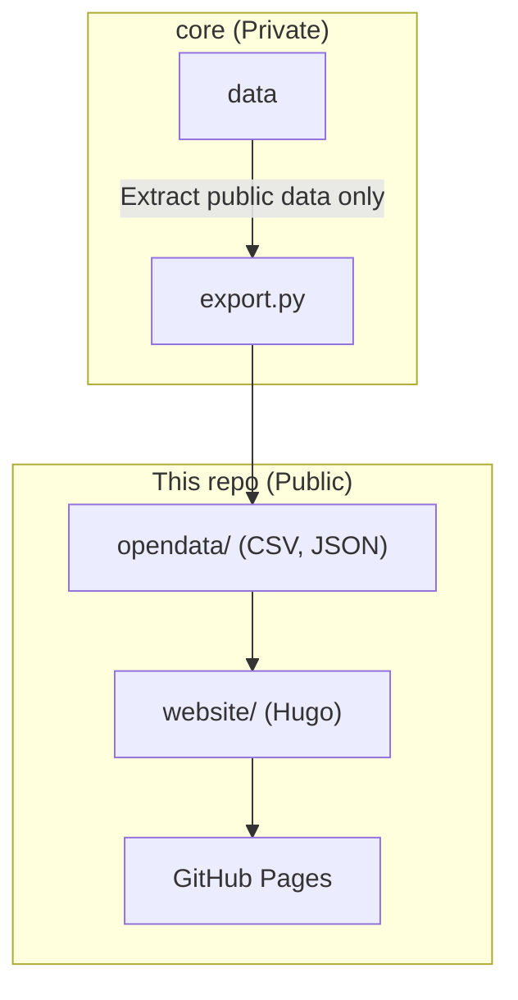

# Toshio Iwai Archive

An archive website for Toshio Iwai's artworks, exhibitions, and media coverage.

> **⚠️ Work in Progress**: This project is currently under development. All data shown is placeholder content. We are preparing for official launch.

- **Website (WIP)**: https://toshioiwai-archive.github.io/

## Project Overview

This project aims to organize and publish archive information about Toshio Iwai. It manages three types of information—works, events, and media—and will provide only publicly available data through the website and as open data.

## Data Publication Policy

Archive information is classified as either public or private:

- **Public**: Information suitable for general release, such as artwork titles, exhibition names, and dates
- **Private**: Unpublished information or details shared only with stakeholders

Private information is managed in a separate private repository. This repository contains only public information.

## Repository Structure

This project consists of two repositories:

| Repository | Visibility | Role |
|-----------|---------|------|
| `core` | Private | Master metadata, image files, processing scripts |
| `toshioiwai-archive.github.io` | Public | Public website, open data distribution |

### Data Flow



## Directory Structure

```
├── opendata/          # Open data (CSV, JSON)
│   └── LICENSE.md     # CC BY 4.0
├── website/           # Hugo static site
│   ├── content/       # Site content
│   ├── themes/        # Hugo themes
│   └── hugo.toml      # Hugo configuration
└── LICENSE.md         # Apache 2.0 (for code)
```

## Local Development

See `website/readme.md` for details.

```bash
cd website
hugo server -D
```

Preview at http://localhost:1313/

## Deployment

Automatically built and deployed via GitHub Actions. Deployment is triggered on push to the `main` branch.

## Tech Stack

- **Static Site Generator**: Hugo v0.145.0+
- **Hosting**: GitHub Pages
- **CI/CD**: GitHub Actions

## License

This repository uses two different licenses:

| Content | License |
|---------|---------|
| Code & configuration files | [Apache License 2.0](LICENSE.md) |
| Open data (`opendata/`) | [CC BY 4.0](opendata/LICENSE.md) |

## Open Data

The `opendata/` directory contains metadata for artworks, exhibitions, and media coverage in CSV and JSON formats.

- **Direct from GitHub**: `opendata/*.csv`, `opendata/*.json`
- **Via website**: https://toshioiwai-archive.github.io/opendata/
