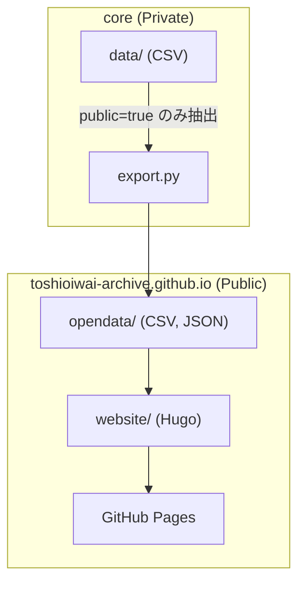

# Toshio Iwai Archive

岩井俊雄の作品・展覧会・メディア掲載情報を公開するアーカイブサイトです。

> **⚠️ 現在準備中**: このプロジェクトは開発中であり、現在掲載されているデータはすべてダミーです。正式な公開に向けて準備を進めています。

- **公開サイト（準備中）**: https://toshioiwai-archive.github.io/

## プロジェクト概要

このプロジェクトは、岩井俊雄に関するアーカイブ情報を整理・公開することを目的としています。作品（works）、展覧会（events）、メディア掲載（media）の3種類の情報を管理し、公開可能なデータのみをウェブサイトおよびオープンデータとして提供する予定です。

## 情報の公開方針

アーカイブ情報には公開・非公開の区分があります：

- **公開情報**: 作品名、展覧会名、開催期間など、一般に公開しても問題のない情報
- **非公開情報**: 未発表の情報、関係者のみに共有される詳細情報など

非公開情報は別のプライベートリポジトリで管理され、このリポジトリには公開情報のみが含まれます。

## リポジトリの使い分け

本プロジェクトは2つのリポジトリで構成されています：

| リポジトリ | 公開設定 | 役割 |
|-----------|---------|------|
| `core` | Private | メタデータの原本管理、画像ファイル、処理スクリプト |
| `toshioiwai-archive.github.io` | Public | 公開用ウェブサイト、オープンデータ配信 |

### データの流れ



## リポジトリ構成

```
├── opendata/          # オープンデータ（CSV, JSON）
│   └── LICENSE.md     # CC BY 4.0
├── website/           # Hugo 静的サイト
│   ├── content/       # サイトコンテンツ
│   ├── themes/        # Hugo テーマ
│   └── hugo.toml      # Hugo 設定ファイル
└── LICENSE.md         # Apache 2.0（コード用）
```

## ローカル開発

詳細は `website/readme.md` を参照してください。

```bash
cd website
hugo server -D
```

http://localhost:1313/ でプレビューできます。

## デプロイ

GitHub Actions により自動でビルド・デプロイされます。`main` ブランチへの push をトリガーにデプロイが実行されます。

## 技術スタック

- **静的サイトジェネレータ**: Hugo v0.145.0+
- **ホスティング**: GitHub Pages
- **CI/CD**: GitHub Actions

## ライセンス

このリポジトリでは2種類のライセンスを使用しています：

| 対象 | ライセンス |
|------|-----------|
| コード・設定ファイル | [Apache License 2.0](LICENSE.md) |
| オープンデータ（`opendata/`） | [CC BY 4.0](opendata/LICENSE.md) |

## オープンデータ

`opendata/` ディレクトリには、作品・展覧会・メディア掲載のメタデータが CSV および JSON 形式で格納されています。

- **GitHub から直接取得**: `opendata/*.csv`, `opendata/*.json`
- **ウェブサイト経由**: https://toshioiwai-archive.github.io/opendata/
